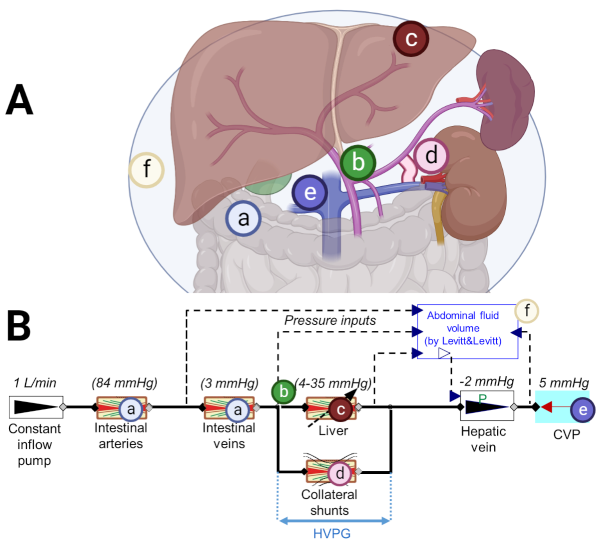

# Beyond HVPG: Using Computational Modeling to Explain the Many Faces of Portal Hypertensive Liver Disease

This page is an electronic addition to a submitted paper *"Beyond HVPG: Using Computational Modeling to Explain the Many Faces of Portal Hypertensive Liver Disease"* by Nikhilesh R Mazumder & Filip Jezek, Elliot B. Tapper and  Daniel A. Beard.

Cirrhosis progressively scars the liver, leading to increasing blood flow resistance. The severity of disease in cirrhosis centers on the pressure drop across the liver (HVPG), however the influence of other disease factors on this pressure have not been previously modeled.

A mechanistical lumped mathematical model is used to investigate hidden properties of hemodynamics in portal hypertension under an effect of a shunt, which grows in diameter with the pressure difference. 

The model explains, how the measured HVPG depends on the shunt remodeling sensitivity and how the clinical stages of cirrhosis might differ among patients based on single parameter, the hypothetized shunt remodeling sensitivity, dividing patients into ascitic or variceal types groups.

The developed model is further used to demonstrate effect of last resort portal hypertension treatment, that is the transjugular intrahepatic portosystemic shunt, on both patient groups.

The model implemented in Modelica is available at [github repository](https://github.com/filip-jezek/Ascites/). Additionally, it is [available for demonstration here](/#ascites.md) in a form of web-based simulator.

## Model overview

**Anatomy (A) and model setup (B) of the base model (without the TIPS). (a) intestines, (b) portal vein, (c) liver (d) shunt, (e) inf. vena cava (f) abdominal cavity with ascites. Created with BioRender.com.**

## Model simulator
[Available for demonstration here.](/#ascites.md)

*More info will follow shortly*
